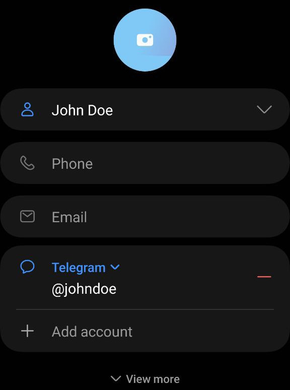

# telegram-tools

A collection of useful tools for automating Telegram accounts


## TeleStickerSync

Update your Telegram sticker pack from a folder of .tgs files.

Creating and updating Telegram stickers have to be done through the [@Stickers](https://t.me/Stickers) bot, which can be a manual process.
This is especially tedious if you would like to update and upload to see how the stickers turn out on Telegram (somewhat a Edit-Compile-Run cycle but for creating stickers)

## TeleContactSync

Telegram does not add contacts for friends who hide their phone numbers, which can be a problem if you want the display names to match those in your contact list. TeleContactSync offers a solution with a two-step process:
1. Add their user ID to a "Messenger accounts" field in your Google Contacts.
1. Sync all such users so that the display names in Telegram match those in your Google Contacts.

This ensures a single source of truth: your Google Contacts, rather than having separate contact information on Telegram and Google.



```
cd TeleContactSync
python main.py entry
python main.py sync
```


## Dependencies
- [`telethon`](https://pypi.org/project/Telethon/) Required to send messages to the [@Stickers](https://telegram.me/stickers) bot on your behalf.


## Setup
You need to get your own api_id and api_hash for the [Telegram API](https://core.telegram.org/api). Click [here](https://core.telegram.org/api/obtaining_api_id#obtaining-api-id) for the instructions.

